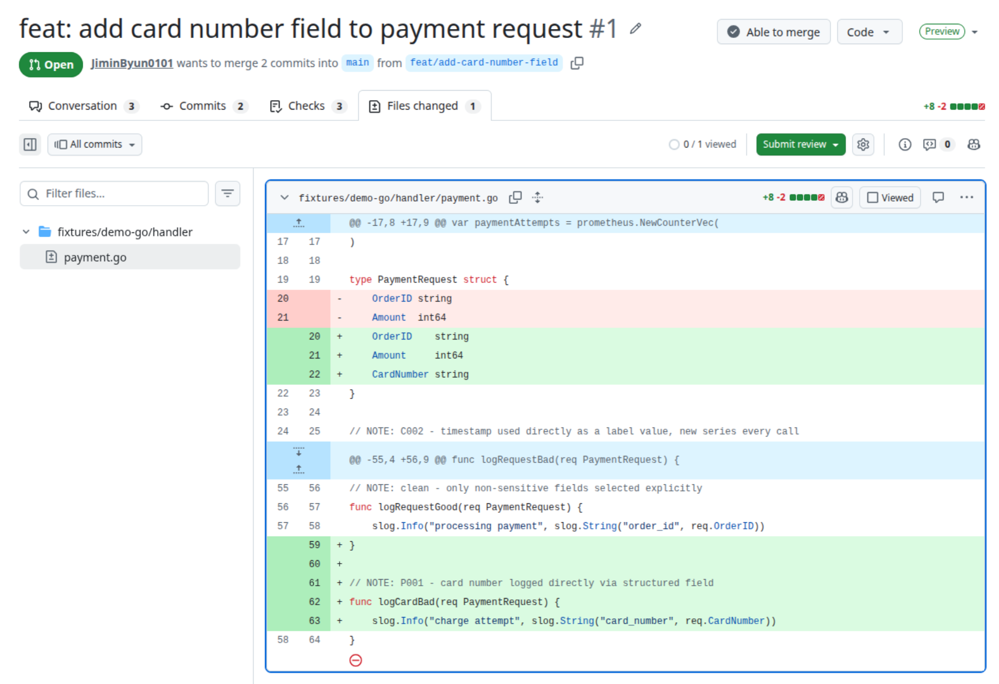
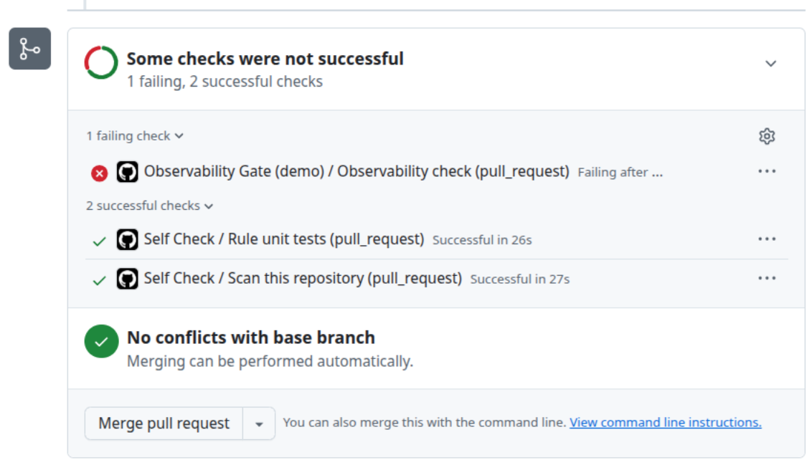
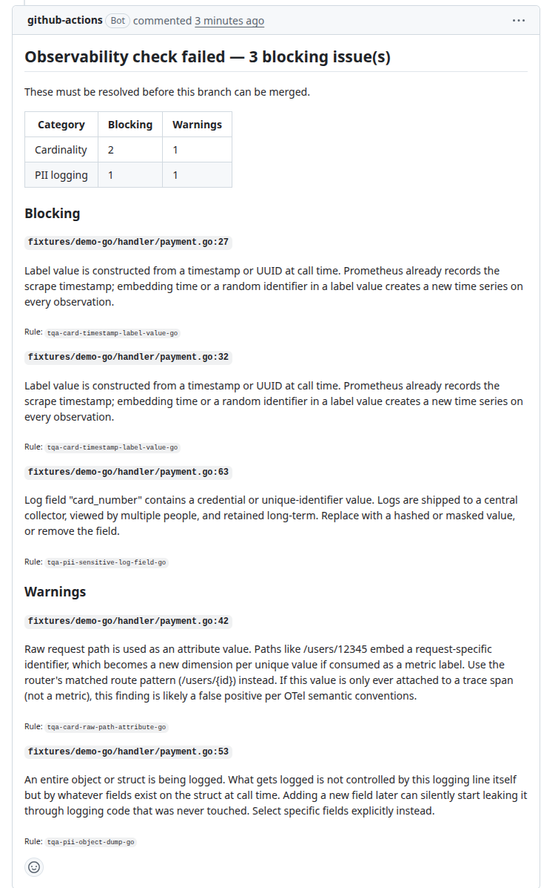
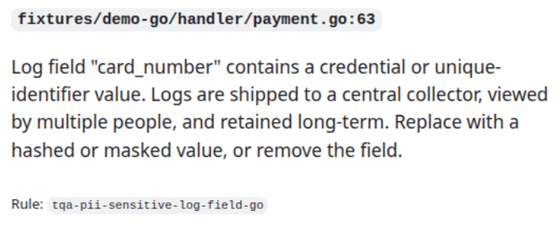
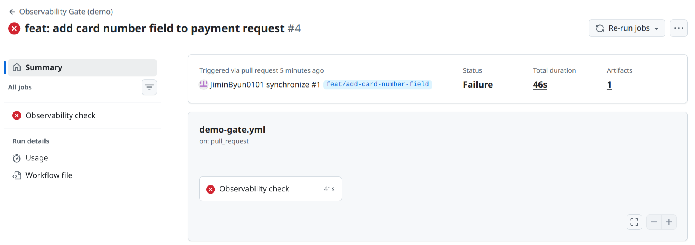

# TelemetryQA

**Proof of concept.** A set of detection rules, built on the open-source tool [Semgrep](https://semgrep.dev), that finds observability defects in code before it reaches production.

Observability defects are bugs in the code that produces metrics, logs, and traces. They share one trait: they don't break a build, they don't look wrong in a code review, and they surface weeks later — in an incident, or in an audit. This project catches them when a pull request is opened instead.

## How it works

A developer adds a field to a request struct. That's the whole change.



The new field holds a card number — the kind of value that should never end up in a log.

Elsewhere in the codebase, a line that has been there all along prints the entire struct to the log:

```go
log.Printf("processing payment request %+v", req)
```

That line is not touched by this pull request. It does not appear in the diff. But it now writes the new field to the log collector, because `%+v` prints whatever fields the struct happens to carry.

The check catches this and fails.



A comment explains what was found, in which file, and why it matters — pointing at the logging line that was never edited, not just the field that was added.



The finding for the new leak, closer up:



The whole check takes under a minute.



The workflow that produces this is [`.github/workflows/demo-gate.yml`](.github/workflows/demo-gate.yml). It scans only the files changed in the pull request, comments the result, and exits non-zero if anything blocking was found.

## What it detects

| Category | Detects | Example |
|---|---|---|
| Cardinality | Metric labels with unbounded value spaces | `[]string{"method", "user_id"}` |
| PII logging | Sensitive values reaching log output | `log.Printf("%+v", req)` on a struct that grows a sensitive field |
| Silent failure | Instrumentation reporting success on failure | an error handled without `span.RecordError` |

Twelve defect types, seventeen rules, Go and Python. Most defects need one rule per language. Full list with code examples and known gaps: [RULES.md](RULES.md).

## Try it

Requires [Semgrep](https://semgrep.dev/docs/getting-started/) 1.x.

```bash
git clone https://github.com/JiminByun0101/telemetry-qa.git
cd telemetry-qa
python3 -m pip install semgrep
```

Scan your own code:

```bash
semgrep --config rules/ /path/to/your/project
```

Scan the test service in this repository, which has defects planted in it:

```bash
semgrep --config rules/ fixtures/demo-go fixtures/demo-python
```

Rules are graded `ERROR` or `WARNING`. To fail only on the confident findings:

```bash
semgrep --config rules/ --severity ERROR --error /path/to/your/project
```

`--error` makes Semgrep exit non-zero when it finds something, which is what a CI job reads to decide whether it failed.

To suppress a specific finding:

```go
// nosemgrep: tqa-pii-card-number-literal
testCard := "4111-1111-1111-1111"
```

Always name the rule. A bare `nosemgrep` silences every rule on that line.

## Detection quality

`fixtures/` is a small mock payment service with defects planted on purpose. `fixtures/ground-truth.json` records where each one is, so the comparison is automatic.

```bash
mkdir -p out
semgrep --config rules/ fixtures/demo-go fixtures/demo-python --json --quiet > out/results.json
python3 scripts/measure.py out/results.json fixtures/ground-truth.json
```

| | |
|---|---|
| Defects planted | 11 |
| Detected | 10 |
| False positives | 0 |
| Recall | 90.9% |
| Precision | 100% |

The one miss is a metric registered through a local helper function rather than a direct call to the Prometheus constructor. It stays in the fixtures so the number reflects the gap. See [RULES.md](RULES.md#infeasible).

These numbers describe a test service written to exercise the rules. How the rules behave on an unfamiliar production codebase is a separate question.

## Testing

Each rule has a companion source file holding the code it should match. Lines marked `ruleid:` must be flagged; lines marked `ok:` must not be.

```bash
semgrep --test --config rules/ rules/
```

The `ok:` lines matter more than they look. Without them, a rule matching every line would still pass.

```bash
semgrep --validate --config rules/
```

## Layout

```
rules/        Detection rules by category, each with a test fixture.
fixtures/     Mock service with planted defects, plus ground-truth.json.
scripts/      measure.py (accuracy), report.py (PR comment).
docs/         Screenshots used above.
```